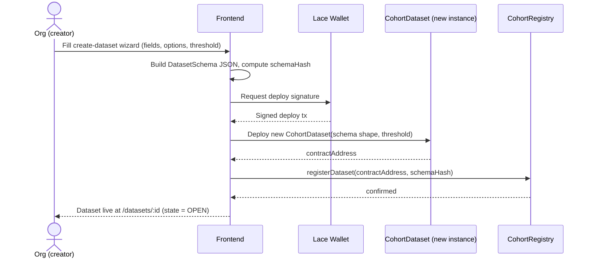
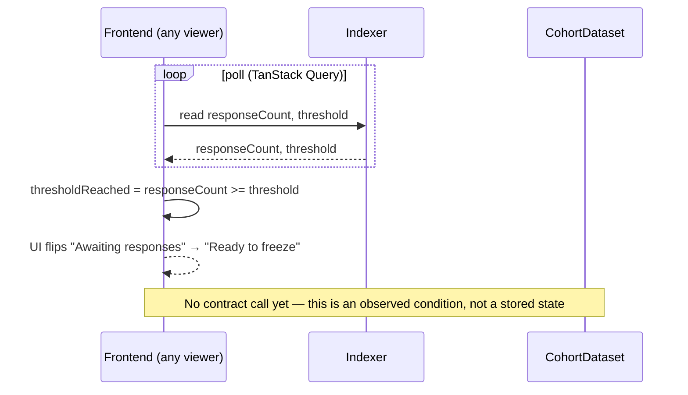
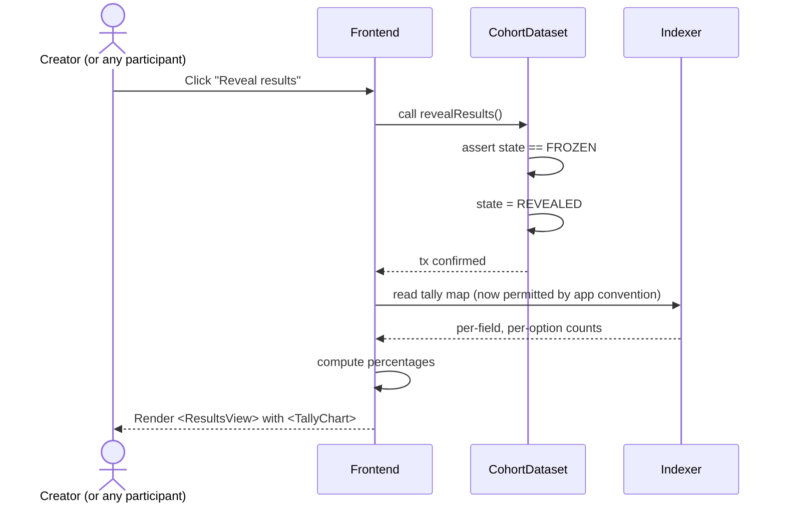

# Cohort — Architecture

Confidential industry-survey protocol built on Midnight. This document is the
system design produced before any implementation. No application code exists
yet — this is the plan the team builds against.

## 0. Design thesis

Cohort has exactly one cryptographic primitive, reused for every dataset:

> An organization can anonymously increment one bucket in a public tally,
> exactly once per dataset, without revealing which bucket it picked or who it is.

Everything — salary bands, incident-severity levels, defect categories, ESG
score tiers, AI benchmark ranges — is "pick one of N labeled buckets." That's
what makes the protocol dataset-agnostic instead of a salary app: the contract
never has a concept of "salary," only `(fieldIndex, optionIndex)`.

Two properties come from real Midnight zero-knowledge circuits, not from
conventions:

- **Unlinkability** — a per-dataset nullifier (`hash(orgSecret, datasetId)`)
  proves "I haven't submitted before" without revealing *which* org submitted.
- **Value privacy** — the org's actual answer is a private circuit witness.
  The chain only ever sees a proof that the increment was valid; the raw
  answer never leaves the browser.

One honest caveat, stated up front rather than glossed over: Midnight's
ledger state is the shared *public* state of the chain (that's how multiple
parties converge on one truth), so per-option tallies are technically
readable on-chain the moment the first response lands — a chain explorer
could poll them early. Cohort does not claim cryptographic hiding of the
running tally pre-threshold. What it guarantees cryptographically is
per-organization privacy (unlinkable, non-replayable, value-hidden). The
threshold gate is a contract-enforced *protocol convention* — `revealResults`
is only callable once `responseCount >= threshold`, and the frontend/indexer
never render tallies before that flag flips. This is the same trade-off every
transparent-ledger commit–reveal scheme makes, and it's the right one for a
48-hour build. True hide-until-threshold (homomorphic tally commitments or
threshold decryption) is a documented V2 idea, not in scope — see Phase notes.

---

## 1. Folder structure

Monorepo, pnpm workspaces. No custom backend service — the only server-side
processes are Midnight's own node / indexer / proof server, run locally via
Docker during dev.

```
cohort/
├── contracts/
│   ├── src/
│   │   ├── registry/
│   │   │   └── CohortRegistry.compact
│   │   ├── dataset/
│   │   │   └── CohortDataset.compact
│   │   └── shared/
│   │       └── primitives.compact        # nullifier + tally helpers shared by both contracts
│   ├── tests/
│   │   ├── registry.test.ts              # Compact TS simulator tests
│   │   └── dataset.test.ts
│   ├── managed/                          # compiler output, gitignored
│   └── package.json
├── frontend/
│   ├── src/
│   │   ├── pages/
│   │   │   ├── Landing.tsx
│   │   │   ├── Explore.tsx
│   │   │   ├── DatasetDetail.tsx
│   │   │   ├── CreateDataset.tsx
│   │   │   └── Dashboard.tsx
│   │   ├── features/
│   │   │   ├── create-dataset/
│   │   │   ├── join-dataset/
│   │   │   ├── submit-response/
│   │   │   └── results/
│   │   ├── components/
│   │   │   ├── ui/                       # shadcn/radix primitives
│   │   │   ├── dataset/                  # DatasetCard, StateBadge, ProgressBar
│   │   │   ├── wallet/                   # ConnectWalletButton, OrgProfileMenu
│   │   │   └── layout/                   # Shell, Navbar, Footer
│   │   ├── hooks/                        # useJoinDataset, useSubmitResponse, useDatasetState...
│   │   ├── lib/
│   │   │   ├── midnight/                 # provider setup, contract client factory
│   │   │   ├── crypto/                   # orgSecret derivation, nullifier hashing
│   │   │   └── utils/
│   │   ├── store/                        # zustand: wallet, orgProfile, uiState
│   │   ├── types/
│   │   ├── App.tsx
│   │   └── main.tsx
│   ├── public/
│   ├── index.html
│   ├── vite.config.ts
│   ├── tailwind.config.ts
│   └── package.json
├── packages/
│   └── shared/
│       ├── datasets/                     # JSON schema + display text per demo dataset
│       │   ├── software-compensation.json
│       │   ├── cybersecurity-incidents.json
│       │   └── manufacturing-quality.json
│       └── types/                        # DatasetSchema, DatasetMeta, TallyResult (shared TS types)
├── scripts/
│   ├── deploy-registry.ts
│   ├── deploy-dataset.ts
│   └── seed-demo-datasets.ts
├── docs/
│   └── ARCHITECTURE.md                   # this file
├── docker-compose.yml                    # local Midnight node + indexer + proof server
├── pnpm-workspace.yaml
└── package.json
```

---

## 2. Tech stack

| Layer | Choice | Why |
|---|---|---|
| Contract language | **Compact** | Midnight's native ZK contract language — this is the whole point of the demo |
| Contract SDK | `@midnight-ntwrk/midnight-js-*` (contracts, types, network-id, indexer-public-data-provider, http-client-proof-provider, private-state provider) | Standard Midnight dApp connector stack |
| Wallet | **Lace** (Midnight-enabled build) | The de facto Midnight wallet; gives us key management for free |
| Frontend framework | **React 18 + TypeScript + Vite** | Fast dev loop, minimal ceremony |
| Styling | **Tailwind CSS + shadcn/ui (Radix)** | Get Linear/Stripe/Vercel-grade polish fast without hand-rolling a design system |
| Motion | **Framer Motion** | Cheap, high-impact micro-interactions for demo day |
| Charts | **Recharts** | Simple, good-looking histograms/bar charts for tallies |
| Forms/validation | **React Hook Form + Zod** | Zod schema doubles as the runtime shape for `DatasetSchema` |
| Local/UI state | **Zustand** | Wallet connection, org profile, UI state — no Redux ceremony needed |
| Async/ledger state | **TanStack Query** | Polling indexer reads, caching, retry — exactly what it's built for |
| Routing | **React Router v6** | |
| Contract tests | Compact's TS-based circuit simulator | Test tally/nullifier logic without a live network |
| Frontend tests | **Vitest** | |
| Local devnet | Midnight standalone `docker-compose` (node + indexer + proof server) | Official local dev pattern |
| Deployment | Frontend → **Vercel**; contracts → Midnight testnet | |

Deliberately excluded: a custom backend/API server, Redux, GraphQL layer,
Nx/Turborepo. None of them earn their complexity at this scope — the ledger
via the indexer *is* the backend.

---

## 3. Frontend architecture

- **Feature-folder structure**: `features/*` hold the multi-step flows
  (create, join, submit, view results). Pages stay thin — they compose
  feature components and hooks, no business logic in a page file.
- **One Midnight client boundary**: `lib/midnight/client.ts` wires up the
  four providers Midnight dApps need (proof provider, public data/indexer
  provider, private-state provider, wallet provider) exactly once, exposed
  through a React context (`MidnightProvider`). Every contract call goes
  through hooks in `hooks/`, never touched directly in components.
- **Contract calls are hooks**: `useJoinDataset(datasetId)`,
  `useSubmitResponse(datasetId)`, `useCreateDataset()`,
  `useDatasetState(datasetId)` (a TanStack Query hook polling the indexer).
  This keeps every component that touches the chain declarative and testable.
- **Crypto stays in one place**: `lib/crypto/` owns org-secret derivation and
  nullifier hashing. Nothing else in the app touches raw secrets.
- **Design system**: shadcn/ui primitives themed once (spacing, radius, type
  scale, one accent color) in `tailwind.config.ts` — reuse everywhere rather
  than one-off styling per screen, which is both faster and what makes the
  UI read as "one system" on demo day.

---

## 4. Midnight contract architecture

Two contracts:

**`CohortRegistry`** (one singleton instance)
Tracks which `CohortDataset` contracts exist, for the Explore page. Stores
only what needs to be trustworthy on-chain: contract address, creator,
schema hash, created-at block. Human-readable text (title, description,
option labels) lives in `packages/shared/datasets/*.json` and is checked
against the on-chain `schemaHash` for integrity — keeps strings, which
Compact/ZK circuits are not built for, off the chain.

**`CohortDataset`** (one instance deployed per dataset)
Owns the actual survey: schema shape (field count, options-per-field),
threshold, nullifier sets, tallies, and lifecycle state. Deployed fresh per
dataset so each dataset's state is fully isolated — no cross-dataset
leakage, no shared mutable registry of sensitive data.

Why not one big contract with a dataset map inside it? It would work, but
mixes every dataset's nullifier/tally state into one contract's storage,
makes per-dataset gas/proof cost grow with the number of datasets, and
blurs the "protocol vs. instance" story we want to tell judges. Two small
contracts is not overengineering here — it's the natural shape of the
problem (factory + instances), and it's what makes "dataset-agnostic"
concretely true instead of just asserted.

Core primitive both contracts share (`shared/primitives.compact`):
nullifier derivation/consumption and bucketed-tally increment. This is the
"one primitive, many datasets" thesis made literal in code.

---

## 5. Authentication flow

No JWTs, no sessions, no password — wallet connection *is* auth, and org
verification is explicitly mocked (per hackathon scope) rather than faked
in a way that pretends to be real KYB.

1. **Connect Wallet** — user connects Lace. We get a wallet handle capable
   of signing.
2. **Mock organization verification** — a short one-time form (org name,
   industry, size band). No real KYB call; this "verifies" instantly and is
   clearly labeled as a demo simplification in the UI copy.
3. **Derive org secret** — the wallet signs one fixed message
   (`"Cohort Identity v1"`). `hash(signature)` becomes the org's persistent
   secret. It's deterministic (same wallet ⇒ same secret every session) but
   never leaves the client and is never transmitted.
4. **Per-dataset nullifiers** — for each dataset interaction, the org secret
   plus `datasetId` (plus an action tag, `"join"` / `"submit"`) are hashed
   inside the circuit as a private witness to produce a nullifier. Only the
   nullifier — never the secret — reaches the chain.
5. **Local profile cache** — org name/industry/size are cached in a
   persisted Zustand store keyed by wallet address, purely for UI
   convenience (avoid re-asking every visit).

---

## 6. Dataset lifecycle

Three stored states, one derived flag:

```
        create           join × N            submit × N
  ─────────────────►  OPEN  ──────────────────────────────► (still OPEN)
                        │
                        │  responseCount >= threshold  (derived, not stored)
                        ▼
                  thresholdReached = true   (informational; submissions still allowed)
                        │
                        │  freeze()  — creator, or anyone once thresholdReached
                        ▼
                     FROZEN   (immutable: no more joins/submits accepted)
                        │
                        │  revealResults()  — only callable when FROZEN
                        ▼
                    REVEALED   (frontend now renders tallies/charts)
```

- `OPEN`: accepting joins and submissions.
- `thresholdReached`: computed client-side and in-circuit as
  `responseCount >= threshold` — not its own stored state, just a condition
  that unlocks the `freeze` circuit and lights up the UI ("enough responses
  to close the round").
- `FROZEN`: hard stop. `join`/`submit` circuits check state and reject.
  Tallies are final from this point on ("datasets become immutable once
  complete").
- `REVEALED`: `revealResults` is a one-way flag flip gated on `FROZEN`. This
  is the contract-enforced version of "results are revealed only after
  threshold" — the frontend refuses to fetch/display tally data for any
  dataset where this flag isn't set, regardless of what the raw ledger
  state contains.

---

## 7. State management

| Concern | Tool | Notes |
|---|---|---|
| Wallet connection, org profile | Zustand (persisted) | Small, synchronous, UI-facing |
| Ledger reads (dataset state, tallies, participant count) | TanStack Query | Polls the indexer; query key = dataset address; short stale time so the UI feels live during a demo |
| Contract writes (join/submit/create/freeze/reveal) | TanStack Query mutations | Optimistic UI where safe (e.g. disable "Join" button immediately), invalidate the relevant query on settle |
| Dataset schema (static) | Plain import from `packages/shared/datasets/*.json` | No fetching needed, bundled at build time |
| Ephemeral form state (submit-response wizard) | React Hook Form, local to the feature | Never persisted — the raw answer must not linger anywhere after the proof is generated |

---

## 8. Component hierarchy

```
<App>
 └─ <MidnightProvider>                     (contract client + providers)
     └─ <Shell>                            (Navbar + Footer + page outlet)
         ├─ <Navbar>
         │   ├─ <Logo>
         │   ├─ <NavLinks>                 (Explore, Create, Dashboard)
         │   └─ <ConnectWalletButton> / <OrgProfileMenu>
         │
         ├─ Explore (page)
         │   └─ <DatasetGrid>
         │       └─ <DatasetCard>          (title, category, StateBadge, ProgressBar)
         │
         ├─ DatasetDetail (page)
         │   ├─ <DatasetHeader>            (title, schema summary, StateBadge)
         │   ├─ <ThresholdProgressBar>
         │   └─ one of, based on (state × user relationship):
         │       ├─ <JoinDatasetPanel>
         │       ├─ <SubmitResponseWizard> (steps generated from schema.fields)
         │       ├─ <AwaitingThresholdPanel>
         │       └─ <ResultsView>
         │           └─ <TallyChart>       (Recharts bar chart per field)
         │
         ├─ CreateDataset (page)
         │   └─ <CreateDatasetWizard>      (name → category → fields/options → threshold → review)
         │
         └─ Dashboard (page)
             ├─ <MyCreatedDatasets>
             └─ <MyJoinedDatasets>
```

---

## 9. Pages and routing

| Route | Purpose |
|---|---|
| `/` | Landing — protocol pitch, "this isn't a salary app" framing, sample datasets carousel |
| `/explore` | Browse all datasets across every category |
| `/datasets/new` | Create-dataset wizard |
| `/datasets/:id` | Dataset detail — content adapts to lifecycle state + whether the connected org has joined/submitted |
| `/dashboard` | Org's own created + joined datasets |

Kept intentionally flat — no nested results route; results render as a
state of the detail page, not a separate page, since "revealed" is just
another lifecycle state of the same dataset.

---

## 10. Contract interfaces

Written as Compact-style pseudocode to communicate shape and intent. Exact
syntax (types, stdlib calls, disclose semantics) will be finalized against
the Compact compiler version pinned at implementation time.

```
// ── shared/primitives.compact ──────────────────────────────
// Nullifier: hash(orgSecret [private witness], datasetId, actionTag)
// Consuming a nullifier = insert into a Set ledger field; presence check
// before insert is what makes join/submit "exactly once."

circuit deriveNullifier(datasetId: Bytes<32>, actionTag: Bytes<8>): Bytes<32> {
  return hash(witness_orgSecret(), datasetId, actionTag);
}

// ── registry/CohortRegistry.compact ────────────────────────
export ledger datasetCount: Counter;
export ledger datasets: Map<Uint<32>, DatasetRecord>;   // index -> record

struct DatasetRecord {
  contractAddress: Bytes<32>;
  creator: Bytes<32>;        // org's public wallet identity, not org secret
  schemaHash: Bytes<32>;     // must match packages/shared/datasets/*.json
  createdAt: Uint<64>;
}

export circuit registerDataset(
  contractAddress: Bytes<32>,
  schemaHash: Bytes<32>
): [] {
  datasets.insert(datasetCount, DatasetRecord { ... });
  datasetCount.increment(1);
}

// ── dataset/CohortDataset.compact ──────────────────────────
export enum State { OPEN, FROZEN, REVEALED }

export ledger state: State;
export ledger threshold: Uint<32>;
export ledger fieldCount: Uint<8>;
export ledger optionCounts: Map<Uint<8>, Uint<8>>;      // fieldIndex -> #options
export ledger participantCount: Counter;
export ledger responseCount: Counter;
export ledger joinNullifiers: Set<Bytes<32>>;
export ledger submitNullifiers: Set<Bytes<32>>;
export ledger tally: Map<Uint<16>, Counter>;            // key = fieldIndex*256 + optionIndex

export circuit join(datasetId: Bytes<32>): [] {
  assert(state == State.OPEN, "dataset not open");
  const n = deriveNullifier(datasetId, "join");
  assert(!joinNullifiers.member(n), "already joined");
  joinNullifiers.insert(n);
  participantCount.increment(1);
}

export circuit submit(
  datasetId: Bytes<32>,
  answers: Vector<Uint<8>>          // private witness: one option index per field
): [] {
  assert(state == State.OPEN, "dataset not open");
  const joinProof = deriveNullifier(datasetId, "join");
  assert(joinNullifiers.member(joinProof), "must join before submitting");

  const submitProof = deriveNullifier(datasetId, "submit");
  assert(!submitNullifiers.member(submitProof), "already submitted");
  submitNullifiers.insert(submitProof);

  for (i in 0..fieldCount) {
    assert(answers[i] < optionCounts.get(i), "invalid option");
    const key = i * 256 + answers[i];
    tally.get(key).increment(1);   // only the bucket count moves; answers[] never stored
  }
  responseCount.increment(1);
}

export circuit freeze(): [] {
  assert(state == State.OPEN, "already frozen or revealed");
  assert(responseCount.read() >= threshold, "threshold not reached");
  state = State.FROZEN;
}

export circuit revealResults(): [] {
  assert(state == State.FROZEN, "must freeze before reveal");
  state = State.REVEALED;
}
```

---

## 11. Data models

```ts
// packages/shared/types

export interface DatasetFieldOption {
  id: string;       // stable option index/key, matches on-chain optionIndex
  label: string;     // e.g. "$120k–$150k", "Critical", "ISO-9001 minor defect"
}

export interface DatasetField {
  id: string;
  label: string;      // the survey question
  options: DatasetFieldOption[];
}

export interface DatasetSchema {
  slug: string;              // used for the JSON filename + schemaHash input
  title: string;
  description: string;
  category:
    | "Compensation"
    | "Cybersecurity"
    | "Fraud"
    | "Manufacturing"
    | "AI Benchmarking"
    | "ESG"
    | string;          // protocol-level: category is just a label, not an enum the contract knows
  threshold: number;
  fields: DatasetField[];
}

export interface DatasetMeta {
  contractAddress: string;
  creator: string;
  createdAt: string;          // ISO timestamp
  state: "OPEN" | "FROZEN" | "REVEALED";
  participantCount: number;
  responseCount: number;
  threshold: number;
  schema: DatasetSchema;      // joined in from packages/shared/datasets
}

export interface TallyResult {
  fieldId: string;
  options: Array<{
    optionId: string;
    label: string;
    count: number;
    percentage: number;
  }>;
}

export interface OrgProfile {
  walletAddress: string;
  orgName: string;
  industry: string;
  sizeBand: string;
  // orgSecret is derived at runtime, never stored in this object or persisted
}
```

---

## 12. Sequence diagrams

### Creating a dataset



### Joining a dataset

```mermaid
sequenceDiagram
  actor U as Org
  participant FE as Frontend
  participant C as lib/crypto
  participant W as Lace Wallet
  participant DS as CohortDataset

  U->>FE: Click "Join dataset"
  FE->>W: Ensure wallet connected
  FE->>C: deriveOrgSecret(wallet signature)
  C-->>FE: orgSecret (never leaves client)
  FE->>DS: call join(datasetId) with orgSecret as private witness
  DS->>DS: assert state == OPEN
  DS->>DS: nullifier = hash(orgSecret, datasetId, "join")
  DS->>DS: assert nullifier not in joinNullifiers; insert
  DS->>DS: participantCount++
  DS-->>FE: tx confirmed
  FE-->>U: "Joined — you can now submit a response"
```

### Submitting a response

```mermaid
sequenceDiagram
  actor U as Org
  participant FE as Frontend
  participant W as Lace Wallet
  participant DS as CohortDataset

  U->>FE: Complete SubmitResponseWizard (pick one option per field)
  FE->>W: Request proof/signature for submit()
  FE->>DS: call submit(datasetId, answers[]) — answers are private witnesses
  DS->>DS: assert state == OPEN
  DS->>DS: assert join-nullifier exists for this org
  DS->>DS: submit-nullifier = hash(orgSecret, datasetId, "submit")
  DS->>DS: assert not already submitted; insert nullifier
  loop each field
    DS->>DS: assert answer < optionCounts[field]
    DS->>DS: tally[field, answer]++
  end
  DS->>DS: responseCount++
  DS-->>FE: tx confirmed (raw answers never left the browser)
  FE-->>U: "Response recorded anonymously"
```

### Threshold reached



### Freezing the dataset

```mermaid
sequenceDiagram
  actor U as Creator (or any participant)
  participant FE as Frontend
  participant DS as CohortDataset

  U->>FE: Click "Freeze dataset"
  FE->>DS: call freeze()
  DS->>DS: assert state == OPEN
  DS->>DS: assert responseCount >= threshold
  DS->>DS: state = FROZEN
  DS-->>FE: tx confirmed
  FE-->>U: Dataset marked immutable; join/submit now rejected
```

### Revealing results



---

## 13. Development phases

Ordered so the team always has *something* demoable, and the riskiest new
technology (Compact/Midnight) gets a full phase of isolated focus rather
than being learned under deadline pressure while also fighting UI bugs.

| Phase | Goal | Demo checkpoint at end of phase |
|---|---|---|
| **0 — Scaffolding** | Monorepo skeleton, pnpm workspaces, local Midnight devnet via `docker-compose`, deploy a trivial "hello world" Compact contract | Node/indexer/proof-server running locally; one contract deployed and callable from a script |
| **1 — Walking skeleton** | `CohortDataset` with plain (non-private) counters: join/submit/freeze/reveal work end-to-end, no ZK privacy yet — just prove the state machine and plumbing | Full lifecycle demoable via CLI/script against one hardcoded dataset |
| **2 — Real privacy** | Swap in nullifier derivation + private-witness answers; add `CohortRegistry`; contract tests via Compact's TS simulator | Same lifecycle, now cryptographically private — this is the core value prop, proven in isolation before UI exists |
| **3 — Core frontend flows** | Wallet connect, mock org verification, Explore page, Create-dataset wizard, Join, Submit — wired to the real contracts from Phase 2 | Two people can, from the browser, create a dataset and both join + submit anonymously |
| **4 — Lifecycle completion + results** | Threshold progress UI, freeze action, reveal action, `<TallyChart>` results view | Full end-to-end demo: create → join × N → submit × N → threshold → freeze → reveal → chart |
| **5 — Design polish** | Apply the shared design system pass: empty states, loading states, animations (Framer Motion), responsive pass, landing page copy/visuals | The app *looks* like Linear/Stripe/Vercel, not like a hackathon project |
| **6 — Demo hardening** | Seed 2–3 datasets across different categories (e.g. compensation + cybersecurity incidents) to prove genericity, scripted demo data, error-state handling, README | Confident, scripted demo day run-through with no live-coding risk |

Phases 0–2 deliberately contain zero UI work — the goal is to de-risk
Compact/Midnight (the least familiar part of the stack) while the frontend
is still just a plan. Phases 3–4 are where "protocol" becomes tangible.
Phase 5 is not optional polish-if-time-allows — given the stated bar
(Linear/Stripe/Apple-level), it's scheduled as a real phase with real time
budgeted, after the functional core already works end-to-end from Phase 4.

**Explicitly out of scope for the hackathon** (call out if asked, don't
build): real KYB/organization verification, homomorphic or threshold-hidden
tallies, multi-field numeric ranges (only bucketed single-select), a custom
backend service, dataset editing after creation.
